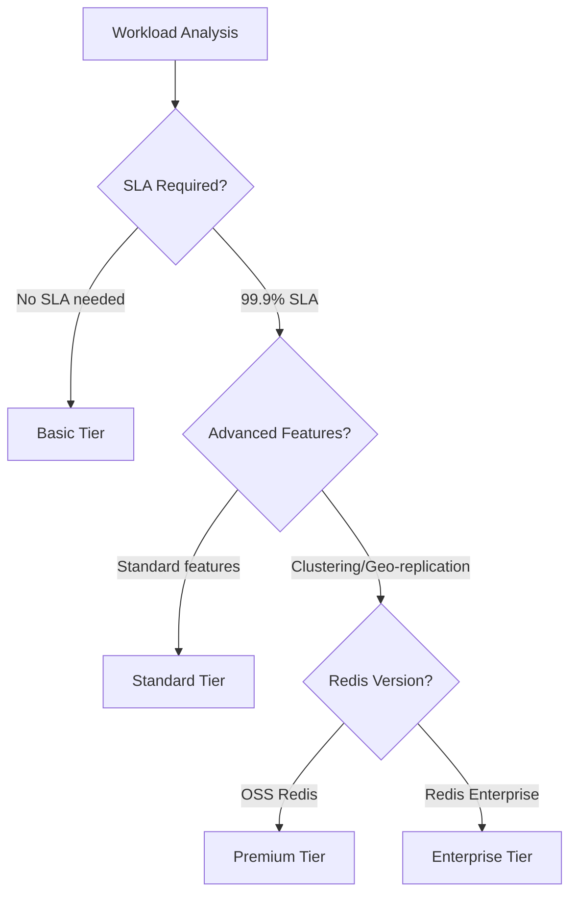

# Evaluate Azure Managed Redis service tiers

_Unit type: Concept | Estimated duration: 12 minutes_

## Learning objectives

- Compare Basic, Standard, Premium, and Enterprise tier capabilities including SLA guarantees and feature sets
- Calculate appropriate tier selection based on throughput requirements, data size, and availability needs
- Evaluate cost-performance trade-offs across tiers for production workload scenarios

Selecting the right Redis tier determines your application's availability guarantees, performance ceiling, and monthly costs. Azure offers five tiers—Basic, Standard, Premium, Enterprise, and Enterprise Flash—each designed for specific workload profiles. Understanding tier capabilities helps you balance budget constraints against business requirements for uptime and throughput.

Basic tier deploys a single Redis node without replication, making it suitable for development and testing environments where data loss is acceptable. This tier offers no SLA and doesn't support high availability features. Standard tier adds automatic replication to a secondary node, providing 99.9% uptime SLA and automatic failover during maintenance or outages [S1]. For production workloads requiring basic caching without clustering, Standard tier delivers reliability at moderate cost.

Premium tier introduces Redis clustering with up to 10 shards, supporting cache sizes up to 1.2TB and 2 million operations per second [S3]. This tier enables VNet injection for network isolation and active geo-replication across Azure regions for disaster recovery [S4]. When your application demands horizontal scaling or multi-region redundancy, Premium tier provides the necessary infrastructure. The 99.95% SLA reflects higher availability through clustered architecture.

Enterprise tiers leverage Redis Labs modules for advanced data structures like JSON, search, and time-series. Enterprise tier runs on Redis Enterprise software with 99.99% SLA and supports up to 4.5TB cache size. Enterprise Flash combines DRAM for hot data with NVMe SSDs for warm data, reducing costs for large datasets with skewed access patterns [S1]. You might choose Enterprise tier when your application requires RediSearch for full-text queries or RedisJSON for native JSON document storage.

With this tier knowledge, you can map workload requirements to service capabilities. Consider a retail application serving 50,000 requests per second during flash sales. Standard tier's single-node throughput limits would create bottlenecks, while Premium tier's clustering distributes load across shards. Cost analysis shows Premium tier at $1,200/month versus Standard tier at $200/month—the investment justifies itself when downtime costs exceed $10,000 per hour. Now you're ready to evaluate security and networking configurations that protect your cache infrastructure.

*Decision tree for selecting Azure Managed Redis service tier based on workload requirements*

Alt text: Flowchart starting with workload analysis, branching on SLA requirements. Basic tier for development with no SLA. Standard tier for 99.9% SLA without clustering. Premium tier for OSS Redis with clustering and geo-replication. Enterprise tier for Redis Enterprise features with 99.99% SLA.

## Additional resources

- [Azure Cache for Redis overview - Service tiers](https://learn.microsoft.com/azure/azure-cache-for-redis/cache-overview) - Detailed comparison of Basic, Standard, Premium, and Enterprise tiers with feature matrices and pricing guidance
- [Redis clustering in Premium tier](https://learn.microsoft.com/azure/azure-cache-for-redis/cache-how-to-premium-clustering) - Technical deep dive on cluster architecture, shard distribution, and scaling operations in Premium tier

## Enhancement suggestions

- **Image:** Premium tier clustering architecture — Diagram showing how Premium tier distributes data across multiple shards with replica nodes for high availability (Alt Text: Architecture diagram showing Premium tier Redis cluster with three master shards, each having one replica node. Hash slots distributed across shards, demonstrating horizontal scaling and automatic failover capability.)
- **Interactive:** Tier selection calculator — Interactive tool where learners input workload requirements (throughput ops/sec, data size GB, availability %, clustering needed) and receive tier recommendations with cost estimates
