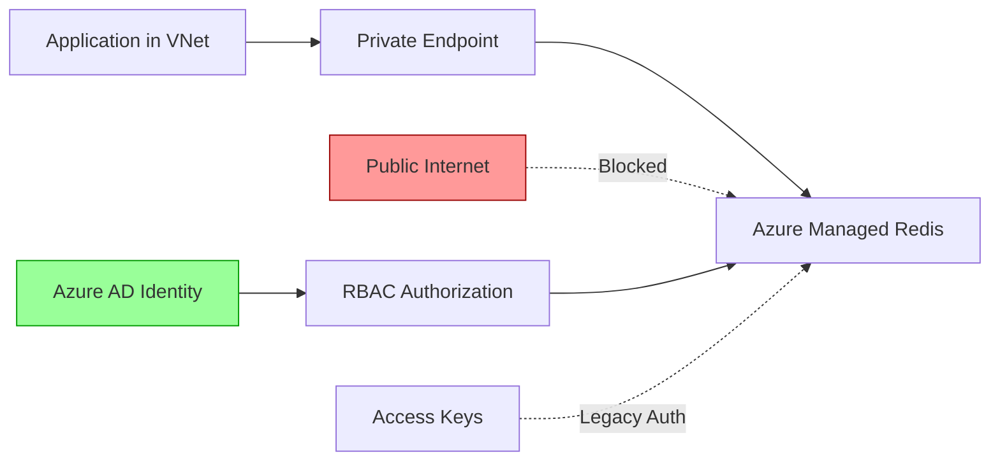

# Configure security and network isolation

_Unit type: Concept | Estimated duration: 13 minutes_

## Learning objectives

- Configure private endpoints to eliminate public internet exposure for Redis instances
- Implement Azure AD authentication with managed identities and RBAC role assignments
- Evaluate security trade-offs between access keys, Azure AD, and private endpoint combinations

Network security determines whether attackers can reach your Redis cache from the public internet. By default, Azure Managed Redis exposes an endpoint accessible from any IP address, creating risk for credential-based attacks. You need defense-in-depth strategies combining network isolation, identity-based authentication, and access control to protect cached data.

Private endpoints eliminate public internet exposure by injecting a network interface into your virtual network (VNet). Your applications connect to Redis through a private IP address (10.0.1.4) that never routes through the internet. DNS resolution automatically maps your cache hostname to the private IP, requiring no application code changes [S2]. This approach works across all tiers, while VNet injection (Premium tier only) deploys Redis directly into your subnet. With private endpoints configured, external attackers cannot reach your cache even if credentials leak.

Azure AD authentication replaces static access keys with identity-based access control using managed identities. Your application requests a token from Azure AD, presents it to Redis, and receives authorization based on assigned RBAC roles. The Redis Data Owner role grants full cache access, while Redis Data Contributor allows read-write operations without administrative privileges [S1]. This pattern eliminates credential rotation burden and provides audit trails showing which identity accessed which keys at what time. Traditional access keys remain available for legacy applications but introduce manual rotation overhead.

Combining private endpoints with Azure AD creates the strongest security posture. Consider a healthcare application storing patient session data in Redis. Compliance requirements mandate network isolation and identity traceability for PHI access. You configure a private endpoint in the application VNet, assign the web app's managed identity the Redis Data Contributor role, and disable access key authentication. Now data flows through private networks only, every cache operation ties to a specific identity, and Azure Monitor logs capture complete audit trails.

Building on this security foundation, you can implement firewall rules for additional IP filtering when private endpoints aren't feasible. Azure Cache for Redis supports TLS 1.2 encryption in transit by default, protecting data during network transmission. The combination of network isolation, identity-based auth, and encryption creates defense layers that satisfy enterprise security frameworks. Next, you'll apply these security concepts while implementing caching patterns that optimize application data access.

*Azure Managed Redis security architecture showing private endpoint isolation and Azure AD authentication flow*

Alt text: Network security diagram showing application in virtual network connecting to Redis through private endpoint. Public internet access is blocked with red styling. Azure AD identity path flows through RBAC authorization to Redis, highlighted in green as recommended. Legacy access key authentication shown as alternate dotted path.

## Additional resources

- [Azure Cache for Redis best practices - Security](https://learn.microsoft.com/azure/azure-cache-for-redis/cache-best-practices) - Security configuration guidance covering private endpoints, Azure AD authentication, TLS encryption, and firewall rules
- [Azure Cache for Redis overview - Authentication](https://learn.microsoft.com/azure/azure-cache-for-redis/cache-overview) - Authentication options including Azure AD integration, RBAC roles, and managed identity configuration

## Enhancement suggestions

- **Image:** VNet injection versus private endpoint comparison — Side-by-side diagram comparing VNet injection architecture (Premium tier) with private endpoint architecture (all tiers) (Alt Text: Side-by-side comparison showing VNet injection on left with Redis deployed inside customer VNet subnet, and private endpoint on right with Redis in Microsoft network accessed via private IP in customer VNet. Annotations highlight tier availability and configuration complexity differences.)
- **Interactive:** Private endpoint configuration walkthrough — Step-by-step interactive guide for configuring private endpoint with DNS resolution and testing connectivity from an application
