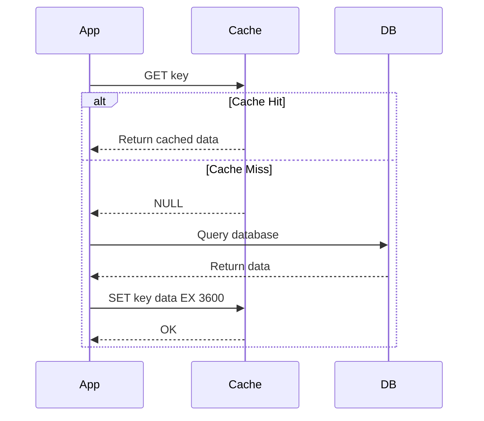

# Implement caching patterns for data access optimization

_Unit type: Concept | Estimated duration: 12 minutes_

## Learning objectives

- Implement cache-aside pattern with appropriate GET and SET operations including TTL configuration
- Compare cache-aside, write-through, and write-behind patterns based on consistency and latency requirements
- Configure eviction policies and TTL values optimized for specific data volatility characteristics

Caching patterns define how your application coordinates data between Redis and the source database. The wrong pattern causes stale data, cache stampedes, or unnecessary write latency. Understanding when to apply cache-aside versus write-through patterns ensures data consistency while maximizing performance gains.

Cache-aside (lazy loading) places responsibility on the application to manage cache population. When your application requests a product by ID, it first queries Redis with GET product:12345. On cache hit, data returns immediately with sub-10ms latency. On cache miss, the application queries the database, receives the product record, and stores it in Redis with SET product:12345 '{json}' EX 3600 [S2]. The EX parameter sets a 3600-second TTL, ensuring automatic eviction after one hour. This pattern works best for read-heavy workloads where data doesn't change frequently—product catalogs, user profiles, or reference data.

Write-through patterns update Redis and the database simultaneously on every write operation. Your application executes SET user:789 '{updated_json}' in Redis, then immediately writes the same data to the database. This approach guarantees cache consistency but doubles write latency since both operations complete synchronously. You might choose write-through for inventory counts where stale data causes overselling, accepting the performance cost to maintain accuracy. Write-behind (write-back) caching queues database writes asynchronously, reducing write latency but introducing brief windows where cache and database diverge.

TTL configuration balances data freshness against database load. Short TTLs (60 seconds) keep data current but increase cache misses and database queries. Long TTLs (24 hours) maximize hit rates but risk serving stale data after source updates. Consider weather data refreshed every 15 minutes—a 900-second TTL provides 93% hit rate while ensuring forecasts stay within one refresh cycle of current conditions. Eviction policies control what Redis removes when memory fills. LRU (least recently used) evicts cold data first, while volatile-ttl removes keys nearing expiration [S2].

With these patterns understood, you can design cache keys for efficient retrieval. Hierarchical naming like user:profile:789 or product:inventory:12345 enables pattern-based deletion with DEL commands. Avoid storing large objects exceeding 100KB in a single key—split them into smaller chunks to reduce network transfer time. Now you're ready to apply these patterns in hands-on deployment exercises that demonstrate cache-aside implementation with TTL optimization.

*Cache-aside pattern sequence diagram showing application logic for handling cache hits and misses*

Alt text: Sequence diagram illustrating cache-aside pattern flow. Application requests key from cache. On cache hit, data returns immediately. On cache miss, cache returns null, application queries database, receives data, stores in cache with 3600 second TTL, then returns data to caller.

## Additional resources

- [Azure Cache for Redis best practices - Caching patterns](https://learn.microsoft.com/azure/azure-cache-for-redis/cache-best-practices) - Detailed guidance on cache-aside, write-through, and read-through patterns with code examples and performance considerations
- [Azure Cache for Redis code samples](https://github.com/Azure-Samples/azure-cache-redis-samples) - GitHub repository containing .NET, Java, and Python sample applications demonstrating caching pattern implementations

## Enhancement suggestions

- **Image:** Eviction policy behavior under memory pressure — Visual showing how LRU, LFU, and volatile-TTL eviction policies select different items for removal when cache reaches max memory (Alt Text: Diagram showing cache at max memory with six items. LRU policy highlights least recently accessed item. LFU policy highlights least frequently accessed item. Volatile-TTL policy highlights item with shortest remaining TTL. Annotations explain selection criteria for each policy.)
- **Video:** Cache eviction policy demonstration — Animated visualization showing how LRU, LFU, and TTL-based eviction policies select items for removal under memory pressure with real-time access pattern simulation
- **Interactive:** TTL and eviction policy calculator — Interactive tool where learners input data volatility (update frequency), access patterns (read/write ratio), and cache size to receive recommended TTL values and eviction policy settings
