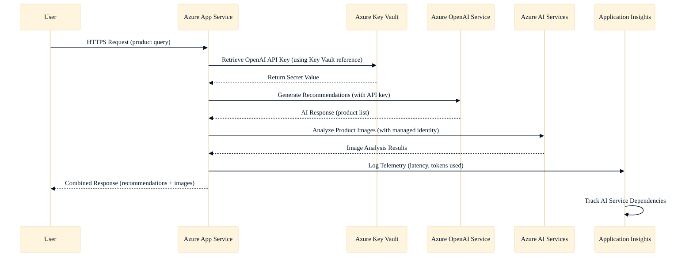

# Configure secure integration with Azure AI services

_Unit type: Concept | Estimated duration: 12 minutes_

Now that you understand how hosting plan selection affects your AI application's performance and cost, the next critical step involves configuring secure connectivity to Azure OpenAI Service and Azure AI Services. Unlike traditional backend databases that reside within your virtual network boundary, AI services expose REST APIs over HTTPS endpoints that your application calls remotely. This distributed architecture introduces credential management challenges—your application needs API keys or access tokens to authenticate each request, creating a security risk if those credentials leak through configuration files, source control commits, or application logs. At the same time, your compliance team requires audit trails showing who accessed AI services and when, while your operations team needs visibility into configuration drift across multiple environments.

## Application settings for service endpoints

Azure App Service provides application settings that inject configuration values as environment variables your code can access at runtime. When you create an application setting named `OPENAI_ENDPOINT` with value `https://your-openai-resource.openai.azure.com`, your Python, C#, or JavaScript code reads this value using standard environment variable methods, eliminating hardcoded URLs that differ between development, staging, and production environments. This pattern becomes especially valuable when your development team deploys the same application code to multiple App Service instances pointing to different Azure OpenAI deployments—changing the endpoint requires updating a single application setting rather than modifying and redeploying code.

Building on this foundation, you face a critical decision about how to handle API keys required for AI service authentication. With application settings, you can store the Azure OpenAI API key directly as an environment variable, giving your code immediate access without additional configuration. However, this approach exposes the key in plaintext to anyone with Contributor access to your App Service resource in the Azure portal. Your security team typically flags this as a compliance risk, especially for production workloads handling customer data or regulated content. Consider what happens when a developer with legitimate App Service access takes a screenshot during troubleshooting—that image might inadvertently capture your API key, creating an exposure path your security team must investigate during audit reviews.

## Key Vault references for secret protection

Azure Key Vault addresses this credential exposure risk by providing centralized secret storage with detailed access logging and automatic rotation capabilities. Instead of storing your Azure OpenAI API key directly in application settings, you store it as a Key Vault secret, then configure an application setting with a special reference syntax: `@Microsoft.KeyVault(SecretUri=https://your-keyvault.vault.azure.net/secrets/openai-api-key/...)`. When your App Service starts, it automatically retrieves the secret value from Key Vault using its managed identity, injecting the decrypted key as an environment variable your application code can read. This becomes powerful when combined with Key Vault's access policies—your security team grants your App Service's managed identity `Get Secret` permissions, while denying individual developers direct access to production secrets, ensuring that only the running application can retrieve sensitive credentials.

With this approach, your operations team gains audit visibility through Key Vault's diagnostic logs, which record every secret access attempt including the identity, timestamp, and success status. When your compliance team asks who accessed the production Azure OpenAI API key during a specific date range, you query Key Vault logs rather than searching application logs or interviewing team members. At the same time, Key Vault's secret rotation capabilities allow your security team to update API keys on a scheduled basis—say, every 90 days—by updating the Key Vault secret value without modifying application settings or redeploying code. Your App Service automatically retrieves the new secret value on the next application restart, maintaining zero-downtime credential rotation.

## Network security with private endpoints

For enterprise AI solutions with strict data residency or compliance requirements, securing the API endpoint itself becomes as important as protecting credentials. Azure Private Link enables you to expose Azure OpenAI Service and Azure AI Services through private IP addresses within your virtual network, ensuring that all traffic between your App Service and AI services traverses Microsoft's backbone network rather than the public internet. This becomes critical in regulated industries like healthcare or financial services, where compliance frameworks mandate that AI-generated content containing customer data never exits your controlled network boundary.

Configuring private endpoints requires VNet integration on your App Service, which is available only in Premium and Isolated hosting tiers. Your network team creates a subnet within your virtual network, then provisions a private endpoint for your Azure OpenAI resource pointing to that subnet. Once configured, your App Service resolves the Azure OpenAI FQDN (for example, `your-openai.openai.azure.com`) to a private IP address (for example, `10.1.2.4`) using Azure Private DNS zones. This setup eliminates public internet exposure of your AI services, satisfying your security team's zero-trust network requirements while introducing operational overhead—your network team must manage DNS configurations, subnet routing, and firewall rules that traditional public endpoint deployments avoid.

## Choosing the right configuration method

Deciding between application settings with plaintext keys, Key Vault references, and private endpoints depends on your specific security, compliance, and operational constraints. For development environments where speed matters more than security, storing API keys directly in application settings accelerates prototyping with minimal setup time—your development team can validate AI service integration in under five minutes. However, this convenience becomes a liability in production, where credential exposure risks and audit requirements demand Key Vault integration.

When your application handles non-sensitive data and your compliance team accepts public endpoint access, Key Vault references provide the optimal balance between security and operational simplicity. Your security team gains centralized secret management and rotation, your operations team accesses detailed audit logs, and your development team works with familiar environment variable patterns. This configuration typically adds 15-20 minutes to initial setup but eliminates ongoing credential management overhead that manual rotation would require.

For regulated workloads or enterprise scenarios with strict network isolation requirements, private endpoints become mandatory despite their complexity. Your network team invests 45-60 minutes configuring VNets, subnets, and DNS zones, then maintains these resources alongside your application infrastructure. This operational cost—measured in both initial setup time and ongoing management—justifies itself only when compliance frameworks or security policies prohibit public internet access to AI services. With these trade-offs understood, you can select the configuration method that aligns with your security requirements, compliance obligations, and team capacity, knowing that Azure App Service supports migration paths as your needs evolve.

*Secure integration sequence showing Azure App Service retrieving secrets from Key Vault and calling AI services with telemetry logging*

Alt text: Sequence diagram illustrating a secure AI application request flow. A user sends an HTTPS request for product recommendations to Azure App Service. App Service retrieves the Azure OpenAI API key from Azure Key Vault using a Key Vault reference, then calls Azure OpenAI Service to generate product recommendations. Next, App Service uses managed identity to call Azure AI Services for image analysis. App Service logs telemetry including latency and token usage to Application Insights, then returns the combined AI-powered response to the user. Application Insights tracks all AI service dependencies throughout the flow.

## Additional resources

- [Key Vault references in App Service](https://learn.microsoft.com/azure/app-service/app-service-key-vault-references) - Detailed guide on configuring Key Vault references for secret management
- [Private endpoints for Azure OpenAI](https://learn.microsoft.com/azure/ai-services/openai/how-to/private-link) - Step-by-step instructions for configuring private network access to AI services

## Enhancement suggestions

- Screenshot of Azure App Service Configuration blade showing an application setting named OPENAI_API_KEY with a Key Vault reference value (@Microsoft.KeyVault(SecretUri=https://...)) and a green checkmark indicating successful secret retrieval
- Screenshot showing the Networking blade of an App Service with VNet Integration enabled and a private endpoint connection listed for Azure OpenAI Service with status 'Approved'
- Interactive module presenting three AI application scenarios (development prototype, production SaaS app, healthcare patient portal) where learners select the appropriate configuration method and explain security or compliance justifications for their choice

## Accessibility notes

Describe each step in the sequence diagram with emphasis on the security mechanisms: Key Vault reference retrieval, managed identity authentication, and telemetry logging. Ensure comparison table relationships between security level and use case are clear for assistive technology.
