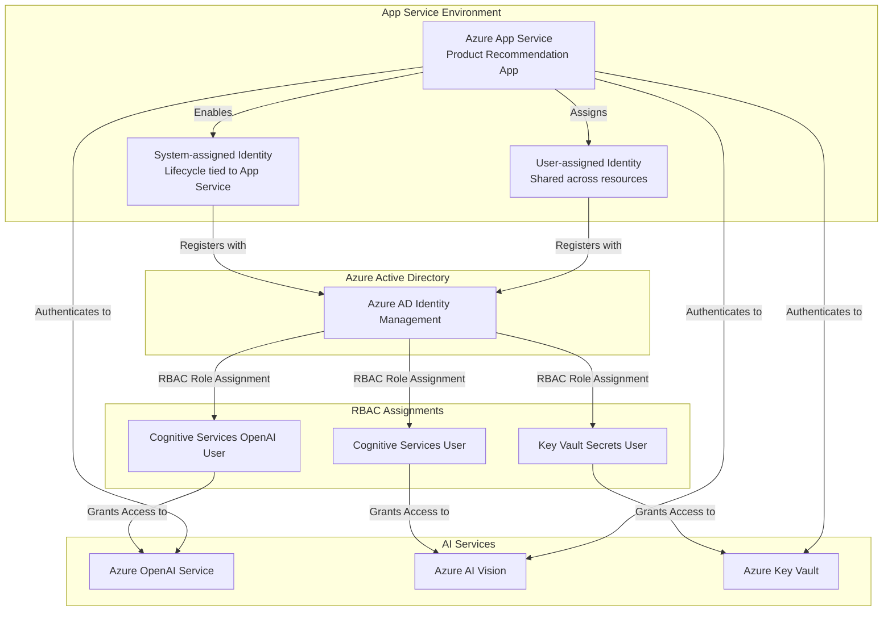

# Implement managed identity authentication for AI services

_Unit type: Concept | Estimated duration: 11 minutes_

While Key Vault references eliminate plaintext credentials in application settings, they still require managing API keys—your security team must rotate secrets periodically, your operations team must monitor key expiration dates, and your development team must update Key Vault references when keys change. Managed identities offer a fundamentally different approach by removing secrets entirely from the authentication equation. Instead of your application proving its identity with a password-like API key, Azure Active Directory issues short-lived access tokens automatically based on the application's assigned identity, creating a zero-credential authentication model that satisfies the most stringent security requirements.

## Understanding managed identity types

Azure App Service supports two managed identity types: system-assigned and user-assigned. When you enable a system-assigned managed identity, Azure creates an identity resource tied exclusively to your App Service instance—this identity exists only as long as the App Service exists, and deleting the App Service automatically removes the identity. This one-to-one lifecycle coupling simplifies identity management for single-application scenarios where your recommendation engine has dedicated Azure OpenAI and Azure AI Services resources. Your development team enables system-assigned identity during App Service creation, then your security team grants that identity the necessary RBAC roles, establishing authentication without ever handling credentials.

User-assigned managed identities, by contrast, exist as independent Azure resources that outlive any single App Service instance. Consider what happens when you operate ten microservices that all need access to the same shared Azure OpenAI deployment—creating ten system-assigned identities would require your security team to assign RBAC roles ten times, once per identity. With a user-assigned identity, you create one identity resource, grant it the required permissions once, then assign that same identity to all ten App Services. This approach reduces administrative overhead significantly in multi-application environments, while giving your security team centralized visibility into which identity accesses which AI services.

## Assigning RBAC roles for AI service access

Once your App Service has a managed identity—whether system-assigned or user-assigned—that identity needs permissions to call Azure OpenAI Service and Azure AI Services. Azure role-based access control (RBAC) governs these permissions through built-in roles designed for AI service scenarios. The **Cognitive Services OpenAI User** role grants permissions to submit inference requests to Azure OpenAI deployments, read model information, and list available models, but denies management operations like creating new deployments or modifying rate limits. This least-privilege approach ensures your application can generate AI-powered recommendations without gaining administrative control over the OpenAI resource itself.

Similarly, the **Cognitive Services User** role provides read and inference permissions for Azure AI Services resources like Computer Vision, Speech, or Language services. When your product recommendation engine needs to analyze product images using Azure AI Vision, you assign the Cognitive Services User role to your App Service's managed identity at the scope of the AI Vision resource. Your security team validates these assignments through the Azure portal's Access Control (IAM) blade, verifying that each identity has only the permissions required for its job function and no more.

With these role assignments in place, your application authenticates to AI services without retrieving secrets from Key Vault or reading API keys from environment variables. Instead, your code uses Azure SDK libraries that automatically request access tokens from Azure Active Directory using the App Service's managed identity. For example, Python code using the `azure-identity` library calls `DefaultAzureCredential()`, which detects the managed identity environment and obtains tokens transparently. This becomes especially powerful during credential rotation—because no secrets exist to rotate, your security team eliminates the operational overhead of scheduled key updates while maintaining continuous audit trails through Azure AD sign-in logs.

## When to use each identity type

Choosing between system-assigned and user-assigned identities depends on your application architecture and operational model. System-assigned identities suit scenarios where your App Service has a one-to-one relationship with AI service resources—for instance, a dedicated recommendation engine that calls only its own Azure OpenAI deployment and no other services. This approach minimizes identity sprawl, reducing the total number of identities your security team must audit. At the same time, deleting the App Service automatically cleans up the identity, preventing orphaned identities that consume management overhead without serving active applications.

User-assigned identities become valuable when multiple applications share AI service resources or when you need identity persistence across App Service lifecycle events. In microservices architectures where five different services call the same Azure OpenAI deployment, assigning a single user-assigned identity to all five App Services reduces RBAC management from five separate role assignments to one. This centralization also simplifies security reviews—your compliance team can audit a single identity's permissions rather than tracking permissions across five system-assigned identities. However, this sharing introduces coordination requirements: your security team must carefully document which applications use each user-assigned identity, and your operations team must validate that deleting one App Service doesn't inadvertently remove identity assignments needed by other running applications.

## Updating application code for managed identity

Transitioning from API key authentication to managed identity requires minimal code changes when using Azure SDK libraries. Traditional code reads an API key from environment variables, then passes that key explicitly when constructing AI service clients. With managed identity, you replace the explicit key with a credential object that handles token acquisition automatically. For Azure OpenAI Service, this means replacing `AzureOpenAI(api_key=os.environ['OPENAI_API_KEY'])` with `AzureOpenAI(azure_ad_token_provider=get_bearer_token_provider(DefaultAzureCredential(), 'https://cognitiveservices.azure.com/.default'))` in Python, or equivalent patterns in C# and JavaScript.

This code pattern works identically across development, staging, and production environments because `DefaultAzureCredential` automatically detects the available authentication method—using your personal Azure CLI credentials during local development, then switching to managed identity when running in App Service. Your development team benefits from this consistency, writing authentication code once that works everywhere without environment-specific conditionals. At the same time, your security team gains confidence that production deployments never rely on developer credentials or hardcoded keys, even temporarily.

## Security and operations team responsibilities

Managed identity authentication shifts security and operations team workflows from credential lifecycle management to identity and access governance. Your security team's primary responsibility becomes reviewing and approving RBAC role assignments—when a new AI application requests access to Azure OpenAI Service, your team validates the business justification, assigns the minimum necessary role (typically Cognitive Services OpenAI User), and documents the assignment in your identity governance system. This review happens once during initial deployment rather than continuously during the application's lifetime, reducing operational toil while maintaining security rigor.

Your operations team monitors managed identity health through Azure AD sign-in logs and App Service diagnostic logs. When Application Insights shows authentication errors calling Azure OpenAI Service, your team checks whether the managed identity still has the required role assignment—configuration drift from accidental permission removal or resource moves can break authentication even when code remains unchanged. With proper monitoring in place, these issues surface through alerts rather than user-reported failures, maintaining SLA commitments while your team investigates root causes. By eliminating secret rotation windows and credential expiration dates, managed identity authentication reduces the number of planned maintenance events your operations team must coordinate, freeing capacity for proactive optimization work.

*Managed identity authentication architecture showing Azure App Service using system-assigned or user-assigned identities with RBAC role assignments to access AI services without storing credentials*

Alt text: Architecture diagram showing Azure App Service with both system-assigned and user-assigned managed identities. System-assigned identity lifecycle is tied to the App Service resource, while user-assigned identity can be shared across multiple resources. Both identity types register with Azure Active Directory. Azure AD grants RBAC role assignments: Cognitive Services OpenAI User for Azure OpenAI Service access, Cognitive Services User for Azure AI Vision access, and Key Vault Secrets User for Azure Key Vault access. The diagram emphasizes that App Service authenticates to all three services using managed identity, eliminating the need to store API keys or connection strings in application code or configuration.

## Additional resources

- [Managed identities for App Service](https://learn.microsoft.com/azure/app-service/overview-managed-identity) - Comprehensive guide on enabling and using managed identities in Azure App Service
- [Azure OpenAI authentication with managed identity](https://learn.microsoft.com/azure/ai-services/openai/how-to/managed-identity) - Step-by-step instructions for configuring managed identity authentication to Azure OpenAI Service

## Enhancement suggestions

- Screenshot of Azure App Service Identity blade with System assigned tab selected, showing the Status toggle set to On with a green indicator and the Object (principal) ID displayed below
- Screenshot of Azure OpenAI Service Access Control (IAM) blade showing the Add role assignment wizard with Cognitive Services OpenAI User role selected and a managed identity listed in the Members section with a checkmark
- Code snippet showing Python code using Azure Identity library's DefaultAzureCredential to authenticate to Azure OpenAI Service without hardcoded keys, with comments explaining how it automatically tries managed identity authentication first
- 4-minute walkthrough demonstrating how to enable system-assigned managed identity in the Azure portal, navigate to Azure OpenAI Service IAM, assign the Cognitive Services OpenAI User role, and update Python application code to use DefaultAzureCredential instead of API keys

## Accessibility notes

Clearly describe the flow from App Service through Azure AD to each AI service, emphasizing RBAC role names and their specific permissions. Ensure the architecture diagram conveys the elimination of stored credentials and the automated authentication process for screen reader users.
